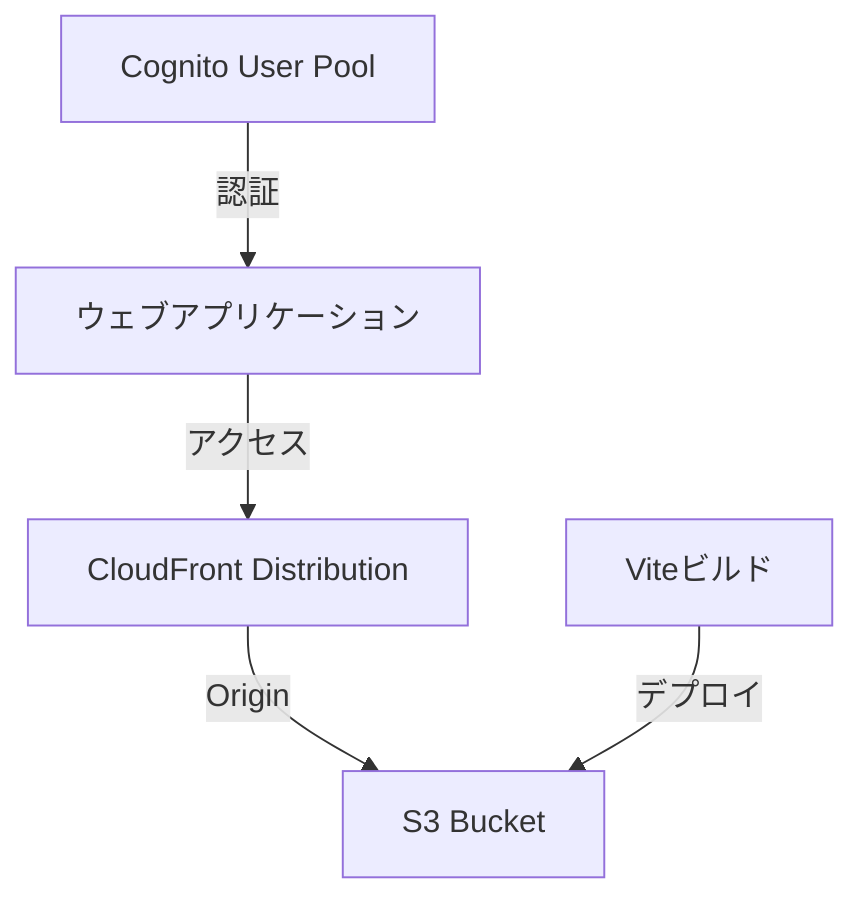

# CloudFront + S3 ホスティング実装計画

## 概要

`@aws-solutions-constructs/aws-cloudfront-s3`を利用して、Vite + Reactで構築されたウェブアプリケーションをホスティングする実装計画です。

## アーキテクチャ



## 実装手順

### 1. 依存関係の追加

```bash
cd cdk
npm install @aws-solutions-constructs/aws-cloudfront-s3
```

### 2. Constructの実装（lib/construct/hosting.ts）

#### 基本設定
- S3バケットの作成
- CloudFront Distributionの設定
- セキュリティヘッダーの設定
- エラーページの設定

#### セキュリティ設定
- バケットポリシーの設定
- CloudFrontからのアクセスのみ許可
- HTTPSの強制

### 3. CDKスタックの更新

- ホスティングConstructの統合
- 環境変数の出力
  - CloudFront Domain Name
  - S3 Bucket Name

### 4. デプロイメント設定

#### ビルド設定
- Viteのビルド出力設定
- 環境変数の設定

#### デプロイスクリプト
```bash
# ビルド
cd web && npm run build

# S3へのアップロード
aws s3 sync dist/ s3://<bucket-name>/

# CloudFrontのキャッシュ無効化
aws cloudfront create-invalidation --distribution-id <distribution-id> --paths "/*"
```

### 5. セキュリティ対策

#### 実装する対策
- セキュリティヘッダーの設定
  - X-Frame-Options
  - X-Content-Type-Options
  - X-XSS-Protection
  - Strict-Transport-Security
- CORSの設定
- 不要なHTTPメソッドの制限

### 6. 監視設定

#### CloudWatchメトリクス
- エラーレート
- リクエスト数
- キャッシュヒット率

#### アラート
- 5xx エラー率
- 4xx エラー率
- 異常なトラフィック

## 展開計画

### フェーズ1: 基本実装
- [x] 基本的なCloudFront + S3の構成
- [x] セキュリティ設定
- [x] デプロイスクリプト

### フェーズ2: 監視・運用（必要に応じて）
- [ ] CloudWatchメトリクスの設定
- [ ] アラームの設定
- [ ] 運用手順の整備

### フェーズ3: 最適化（必要に応じて）
- [ ] キャッシュ戦略の最適化
- [ ] パフォーマンスチューニング
- [ ] コスト最適化

## 注意事項

1. デプロイ前の確認事項
   - 環境変数の設定
   - ビルド成果物の確認
   - セキュリティ設定の確認

2. 運用上の注意
   - キャッシュ無効化の適切な実行
   - 定期的なセキュリティ設定の見直し
   - コストモニタリング

## 次のステップ

1. Constructの実装
2. デプロイスクリプトの作成
3. テストデプロイの実施
4. 動作確認